개념적 데이터 모델링
-

📌 크로즈 풋 표기법
-
* ER 다이아그램을 만드는데 사용할 표기법 중 하나
* 엔티티를 직사각형 모양으로 나타낸다.
* 아래는 예제이다. 예제를 살펴보자

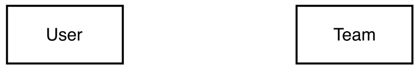
* User와 Team이 존재한다.

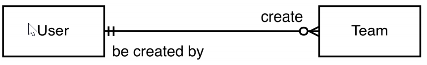
* User와 Team의 관계
* 정확히 1개의 유저가 0개 이상의 Team을 생성한다.
* 0개 이상의 팀이 1개의 User에 의해 생성 될 수 있다.

 

📌 크로즈 풋 표기법의 관계와 기호
-
다음은 크로즈 풋 표기법의 관계 기호다.

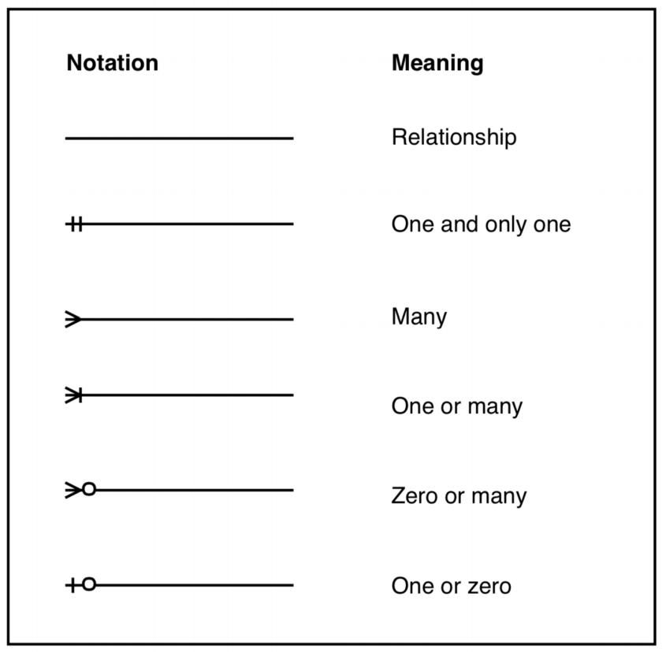
* 위에서 부터 차례대로 "관계", "1", "다수", "1 이상", "0 이상", "1 또는 0"의 의미이다.

관계도 그리는 사이트 : <https://www.draw.io/> 에 들어가면 깃허브 저장소와 연동해서 ER 다이어그램을 그릴 수 있다.

 

📌 명명 규약
-
* ER 다이어그램에 대한 명명 규약(naming convention)을 가져야 한다. 어떤 것이던 상관없지만, 일관성을 띄어야 한다.
* 다음과 같은 추천사항이 있다.
    1. 엔티티 이름은 복수가 아닌, 단수로 짓는다. 예를 들어 Users 대신 User를 사용한다. 이때 Card List는 요구사항에 있는 실제 이름이기 때문에 그냥 Card List로 한다.
    2. 엔티티 이름은 단어 첫 글자가 대문자여야 한다. 예를 들어 Board member 대신 Board Member를 사용한다.
    3. 관계 이름은 동사 원형 형태여야 한다. 예를 들어 creates 나 is created by 보다 create나 be created by 를 사용한다.
    4. 속성 이름의 시작은 대문자이다.

 

📌 TaskAgile 개념적 데이터 모델
-
* 앞서 데이터 모델링은 1. 개념적 데이터 모델링, 2. 논리적 데이터 모델링, 3. 물리적 데이터 모델링이라고 했다. 
* 엔티티와 엔티티간의 관계를 찾아 개념적 모델링을 시작한다.    
* 속성을 작성하는 것은 논리적 데이터 모델링에 맡겨두고 제외하도록 한다. 세부 사항으로 인해 어려움을 겪지 않아야 한다.
* 먼저 **사용자와 팀 테마**에 대해 먼저 다룬다. (테마 단위로 다룬다.)
* (그리고 스토리는 개념적 모델링이 가능하도록 짜였다.)

 

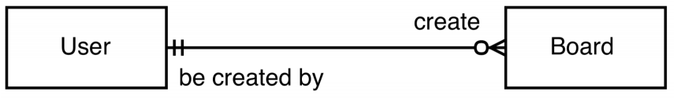
* 1개의 User는 0개 이상의 Board를 생성한다.
* 0개 이상의 Board는 1개의 User에 의해 생성 된다.

 

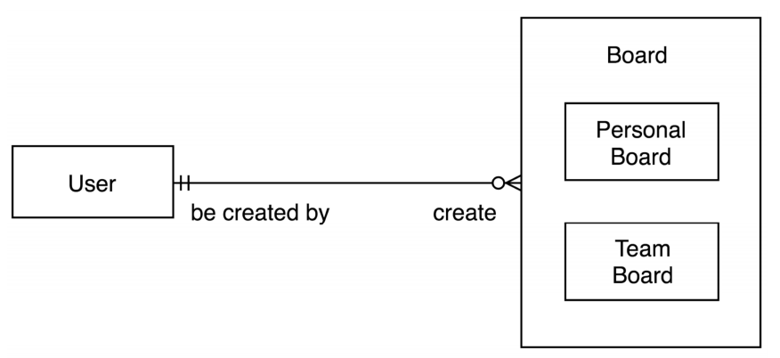
* 그런데 보드의 경우, 팀에 속한 보드도 있을 것이고 개인에 속한 보드도 있을 것이므로 Board의 서브타입을 개인, 팀으로 2개 생성한다.
* 1개의 User가 팀 또는 개인 보드를 0개 이상 생성한다.
* 팀 또는 개인 보드는 0개 이상 1개의 User에 의해 생성된다.

 

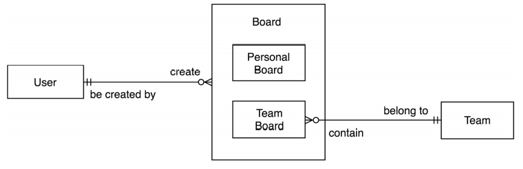
* 한편 0 개 이상의 팀 보드가 1개의 팀에 속할 수 있다.
* 1개의 팀은 0개 이상의 보드를 포함할 수 있다.
* 한편 이는개인 유저 1명이 팀 보드를 생성할 수 있다는 말이 되므로 여전히 정확하지 않다.
* 그리고 스토리 상에 적힌 "등록된 사용자로서 팀보드를 생성할 수 있다"는 말 또한 "팀 생성자로서 팀 보드를 생성할 수 있어야 한다"라는 말이 논리적으로 맞다.

 

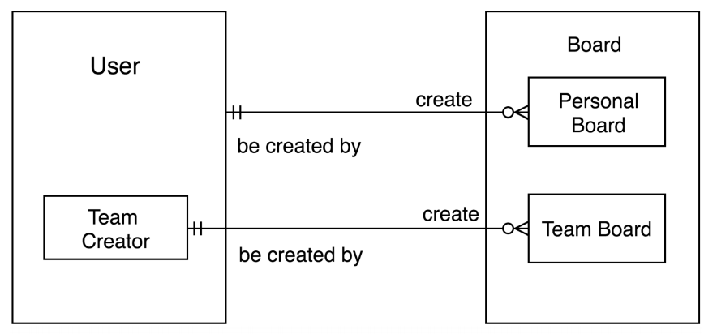
* 따라서 그림은 이렇게 되어야 한다. 이제 Team 생성자가 Team Board를 0개 이상 생성할 수 있다.

 

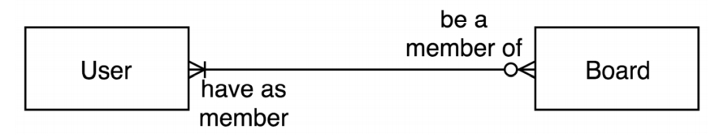
* 1개 이상의 유저는 0개 이상의 보드의 멤버가 된다.
* 0개 이상의 보드는 1개 이상의 유저의 보드로 속할 수 있다.

 

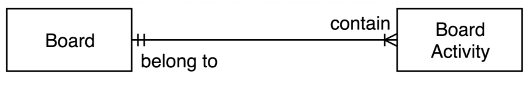
* 하나의 보드는 1개 이상의 보드 활동을 가질 수 있다.
* 1개 이상의 보드 활동은 1개의 보드에 속한다.

 

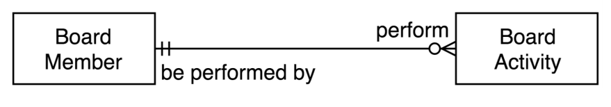
* 1개의 보드 멤버는 0개 이상의 보드 활동을 수행한다.
* 0개 이상의 보드 활동은 1명의 보드 멤버에 의해 수행된다.

 

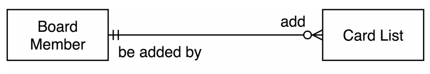
* 1명의 보드 멤버는 0개 이상의 카드리스트를 추가할 수 있다.
* 그런데 Board Member는 User의 서브타입이다. 따라서 모든 사용자는 보드 멤버의 역할을 수행할 수 있어야 하는데, 이는 비지니스 로직으로 봤을 때 틀린 말이다.
* 따라서 Board Member는 User의 서브 타입이 아닌, 새로운 엔티티가 되어서 나와야 한다. 

 

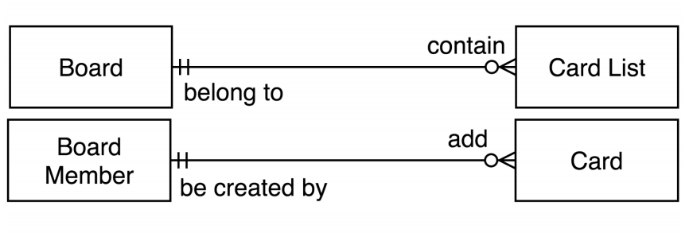
* 1개의 보드는 0개 이상의 카드리스트를 포함할 수 있다.
* 1명의 보드 멤버는 0개 이상의 카드를 추가할 수 있다.

 

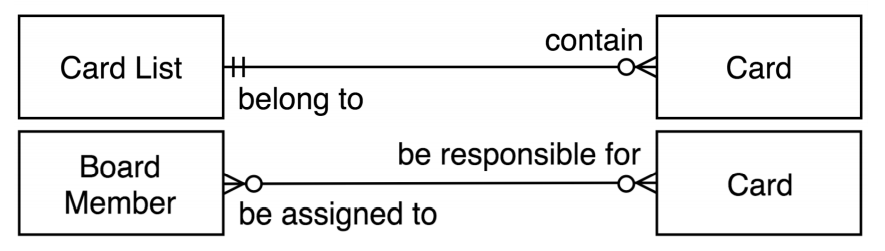
* 그런데 0개 이상의 카드는 1개 이상의 카드리스트에 포함될 수 있다.
* 또한 0명 이상의 보드 멤버는 0개 이상의 카드에 책임이 있다. => 즉 이 말은, 보드의 멤버이면 카드를 관리할 수 있는 책임이 있다는 말이다.
* 0개 이상의 카드는 0명 이상의 보드 멤버에게 할당된다. 

 

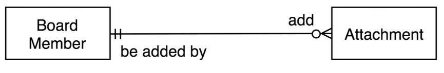
* 1명의 멤버는 0개 이상의 부착물을 추가할 수 있다.

 

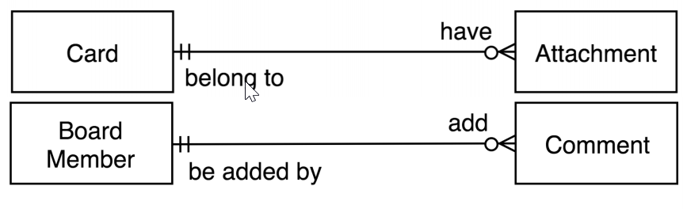
* 0개 이상의 부착물은 1개의 카드에 속한다. 즉, 1명의 멤버가 만든 부착물은 카드에 만드는 것이다.
* 1명의 보드 멤버는 0개 이상의 댓글을 추가할 수 있다.

 

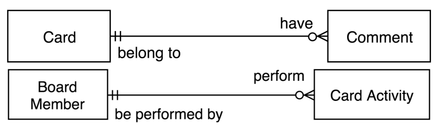
* 이 때 0개 이상의 댓글은 하나의 카드에 포함된다.
* 한명의 멤버는 0개 이상의 카드 활동을 수행한다.

 

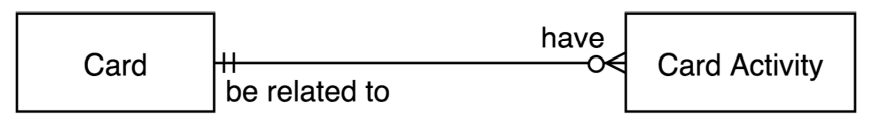
* 1개의 카드는 0개 이상의 카드활동을 가진다.
* 0개 이상의 카드활동은 1개의 카드와 연관된다.

 

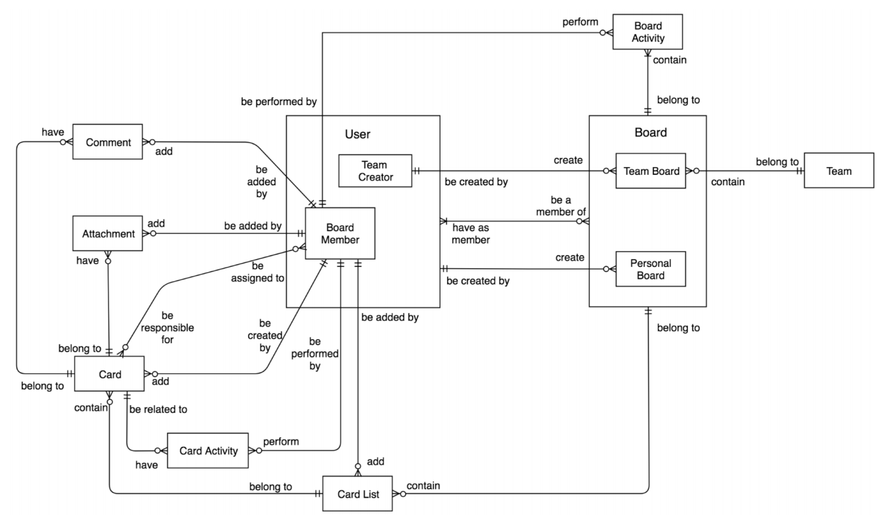
* 이 부분에서 아까 말한대로 하면 Board Member의 모든 기능을 User가 수행할 수 없고 이는 Board Member의 속성이 User에는 없기 때문이다. (권한)
* 따라서 저 둘은 분리 되어야 하며, Team Creator 또한 마찬가지이다. User는 개인 보드는 가질 수 있으나, 팀 보드를 생성할 수 없기에 Team Creator 또한 User와 분리되어야 한다.
* 그렇기에 아래 그림은 틀렸다.
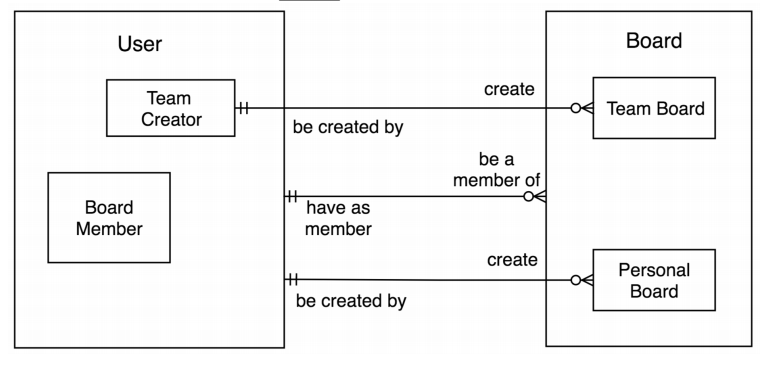

 

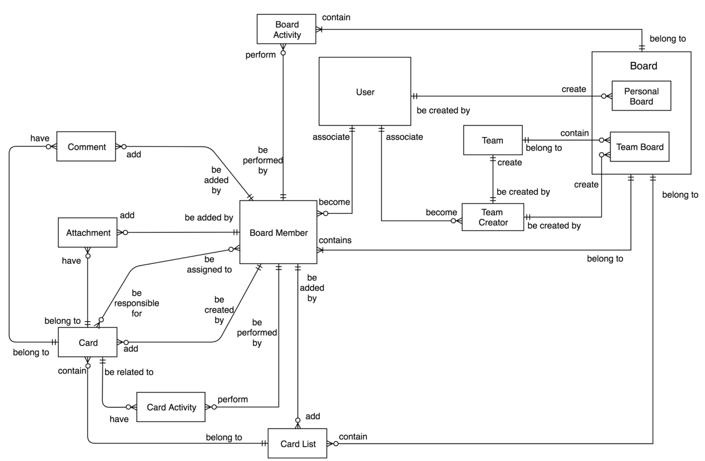
* 최종 모양은 이러하다.
* 1개의 Board Member는 1개의 Board에 속해야 하기 때문에 

 

📌 서브타입과 수퍼타입
-
* 서브타입과 수퍼타입은 공통 속성을 공유하며, 수퍼타입과 다른 엔티티 간의 관계를 서브 타입에도 적용될 수 있어야 한다.  
* 이를 이용해서 관계가 서브타입이 되어야 할지 새로운 객체가 되어야 할지 테스트 할 수 있다.