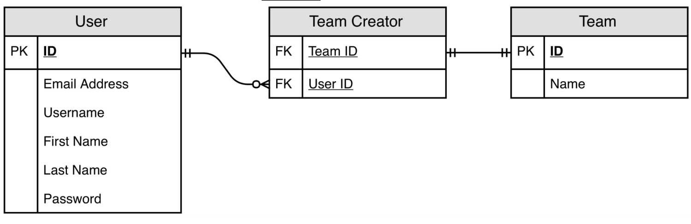
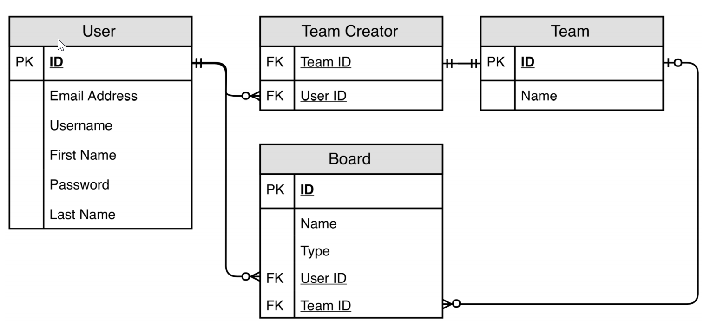
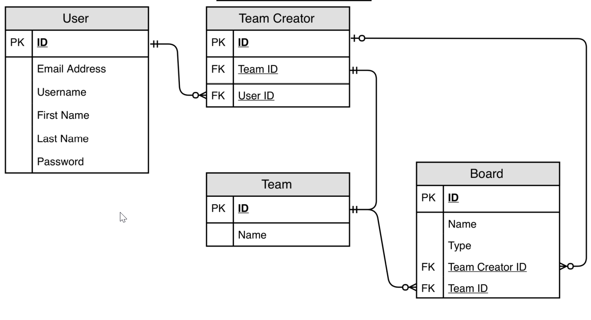
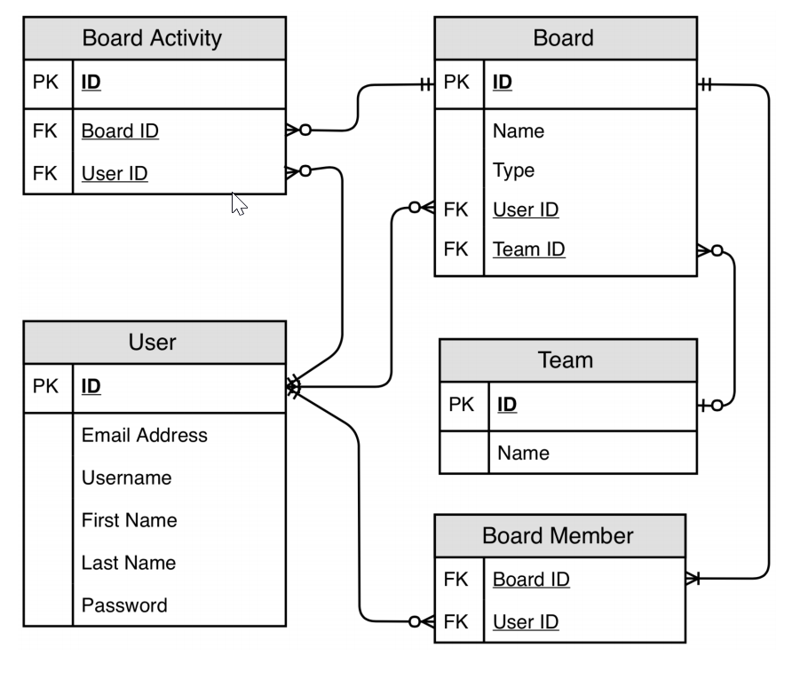
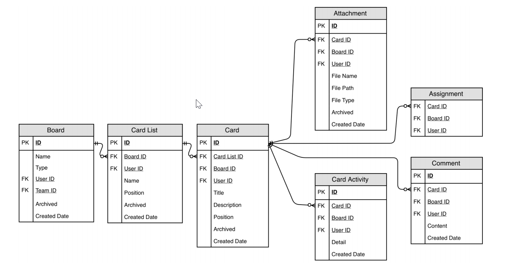
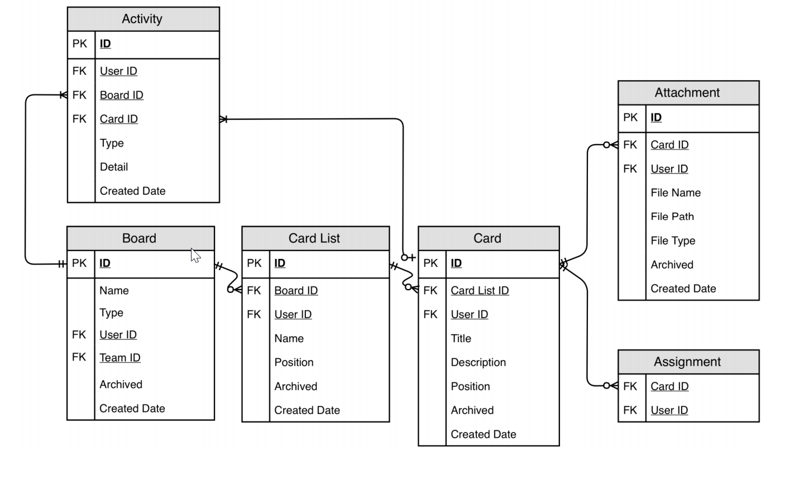
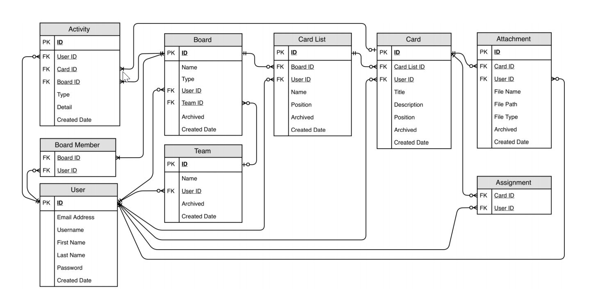

논리적 데이터 모델링
-

유저와 팀의 관계
-

* User와 Team에는 각각의 ID가 있고 Team Creator 에는 두 아이디를 저장하는 식별자가 있다.
* Team Creator 테이블은 두개의 외래키가 들어가서 고유하게 식별할 수 있는 복합키를 형성한다.
* 그리고 보면 알겠지만, 개념적 데이터 모델링에서 설계한 카디널리티 관계가(개수 관계) 그대로 적용되고 있다.

 

유저와 팀 생성자, 보드의 관계
-

* 개념적 데이터 모델링에서 Board의 타입을 두개로 나누었다. 따라서 보드의 타입을 구분할 수 있는 Type 컬럼이 필요하다.
* Personal 보드와 Team 보드는 수퍼와 서브의 관계가 아닌, 서브와 서브의 관계이므로 서로 다른 외래키에 값이 들어간다. 예를 들어서 Personal 보드는 UserID는 값이 들어가고 Team ID의 값은 null이다.
* 보드를 추가하는 사용자가 반드시 팀의 생성자일 필요는 없기에 위와 같은 테이블 관계도를 만들었다.

 

만약 팀 생성자만 보드를 추가할 수 있는 제약 사항을 추가하려면 아래와 같이 설계하면 된다.
-

* 이렇게 하면 Board 테이블에 Team Creator ID를 받기 때문에, 오직 Team Creator에 의해 Board가 생성될 것이다. 
* 허나 이는 나중에, 다른 팀 멤버가 보드를 생성하도록 허용할 수 있는 권한을 주려고 할 때 추가 작업을 해야한다.
* 또한 join을 할때 User ID를 통해서 join 할 텐데, 2번 또는 심하면 3번 (팀원이 보드를 생성했을 때) 조인해야하는 불상사가 생기기 때문에 "유저와 팀 생성자, 보드의 관계"의 사진 처럼 설계를 하는 것이 낫다.

 

보드와 유저, 보드활동의 관계
-

* Board Member는 User가 어떤 Board의 Member인지 식별하기 위해 Board ID와 User ID를 외래키로 써서 복합키를 형성한다.
* 위와 똑같은 복합키를 Board Activity 에서도 사용한다. (User ID + Board ID)
* User와 Board Activity는 1대 다 관계이고 Board Member와 Board Activity 또한 1대 다 관계이지만, 이 둘은 개념적 모델에서와 달리 연결 되어 있지 않다.
* 그 이유는 이미 Board Member를 식별하는데 두가지 키를 사용해서 복합키를 형성하고 있고 Board Activity 또한 같은 방식으로 식별할 수 있기 때문에 굳이 Board Member에 ID를 추가해서 Board Activity에 추가할 필요가 없는 것이다.

 

Card, Card List 관련 엔티티의 논리적 데이터 모델
-

* 보다 시피, Card List, Card, Attachment, Card Activity, Assignment, Comment 엔티티는 Board Member의 복합키인 Board Id와 User Id 를 사용한다.
* 이 것이 Card List 데이터의 중복을 일으킬 것이다. 보드간에 카드를 옮기는 경우를 생각해보면, 어떤 보드 앞에 어떤 카드가 할당 되어 있는 것인지 어떻게 알 수 있을까?
* 중복 뿐 아니라, 업데이트시, 다른 데이터도 같이 업데이트가 될 것이므로 데이터 불일치나 성능 문제가 발생할 것이다.
* 따라서 Board ID를 제거한다. 대신 카드 리스트가 Board ID를 가지고 Card는 Card List ID (Card List 하위)를 포함하면서 이와 같은 문제를 해결할 수 있다.

 

보드 활동, 카드활동보기
-
* "보드 멤버로서, 나는 해당 보드에서 어떤 일이 발생했는지 이해할 수 있도록 해당 보드의 모든 활동을 볼 수 있다." 
* 위 사용자 스토리를 충족시키기 위해서, Board Activity, Card List Activity, Card Activity를 나누는 것을 말이 안된다.
* select 할 때, 최근 활동 15개 보기를 하려면 어떻게 가져와야하는가? 각각의 테이블에서 15개 씩 가져와서 시간별로 조합한 45개의 리스트에서 15개를 추출해서 보여줘야 하는가?
* 위와 같이 하면 성능 문제, 개발의 어려움 등등이 발생할 것이다. 따라서

* Activity 테이블을 하나로 만들고, Type을 통해서 Board활동과 Card 활동을 구분한다. 불론 각각 테이블 기본키인 Board ID와 Card ID를 모두 가지고 있는다
* 이 부분은 중요한데, Board Activity와 Card Activity는 서로 다른 데이터 형식을 가질 수 있다. 그럼 두 활동 형식을 모두 만족시킬 수 있도록 모든 컬럼을 생성해야 하는가?
* 컬럼을 여러개 만들어서 관리를 어렵게 하기보단, Detail이라는 **JSON**을 받는 컬럼을 하나 추가해서, 하나의 컬럼으로  두 활동간의 형식 차이에서 발생하는 문제를 해결하도록 한다.

* 한편 Team Creator 엔티티를 제거했다. 
* 이유는 1:1 관계이고 Team Creator에 Team 엔티티와 다른 별도의 정보를 저장하고 있지는 않기 때문이다.

 

* 최종 완성된 논리적 데이터 모델링
* 논리적 데이터 모델링은 개념적 데이터 모델링과 달리 테이블 조인을 줄여 성능 향상과 설계의 확장성을 가질 수 있도록 만들어야 한다.

