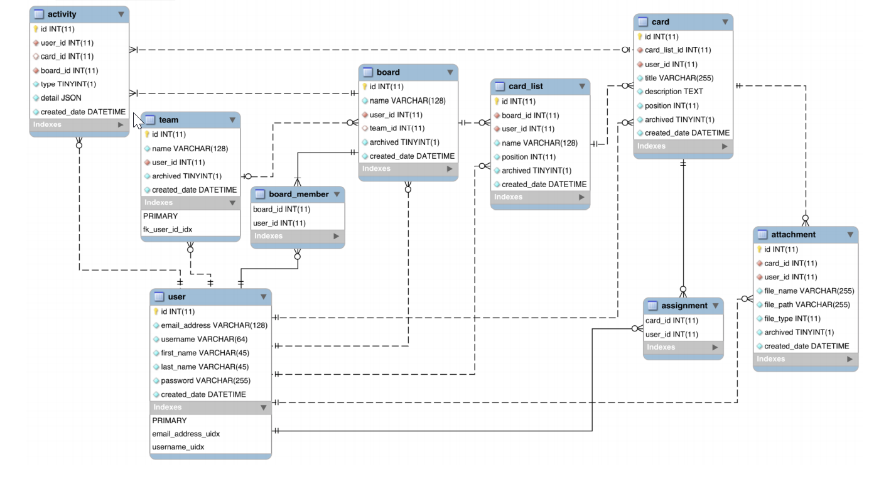

📌 물리적 데이터 모델링
-
* 물리적 데이터 모델링에서 해야할 일은 다음과 같다.
    1. 각 엔티티를 위한 테이블 생성
    2. 각 속성을 위한 칼럼 생성하기, 이외 칼럼 유형, 길이, null 여부, 기본값 등등을 정의
    3. 기본 키를 자동 증가로 설정하기
    4. 인덱스 생성하기

 

📌 명명 규약
-
* 컬럼은 무조건 소문자. DB가 운영체제 별로 대소문자를 구분하고 하지 않는 경우가 있기 때문. 대부분의 경우 소문자는 지원함
* 외래키 명명 규약은 fk_<참조하는 테이블>_<참조**되는**테이블>_<참조하는 필드>
* 예를 들어서 activity 테이블에서 user의 id를 참조한다면, fk_activity_user_user_id
* 인덱스를 정의할 때 인덱스 이름은 _idx로 끝난다. 고유한 인덱스라면 _uidx로 끝난다.

* 물리적 데이터 모델링에서는 Workbench로 다이어 그램을 생성했는데, 이것으로 생성된 다이어그램은 **향샹된 엔티티 관계 다이어그램**이다.
* 점선과 실선으로 식별할 수 있는 관계인지, 식별할 수 없는 관계인지 표기해준다.
* 식별 관게는 하위 테이블이 상위 테이블 없이 고유하게 식별 될 수 없음을 의미함. => 즉, 하위 테이블은 상위 테이블의 기본키를 식별자(기본키 또는 복합키)로 사용하고 있다는 의미이다.

 
