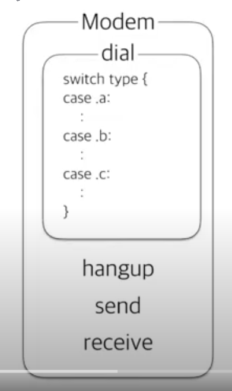
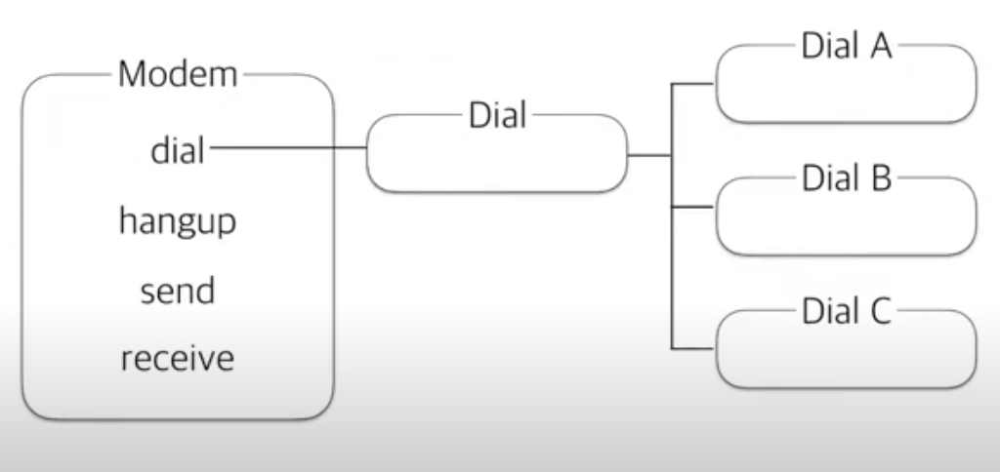
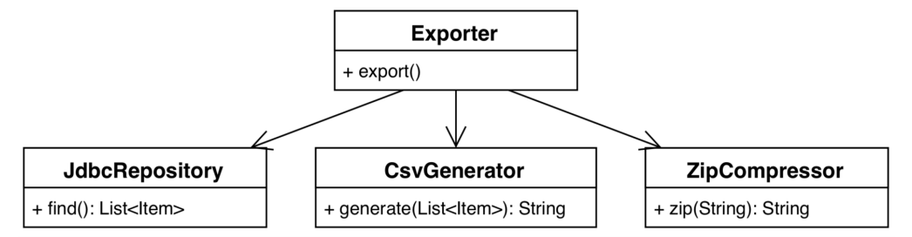
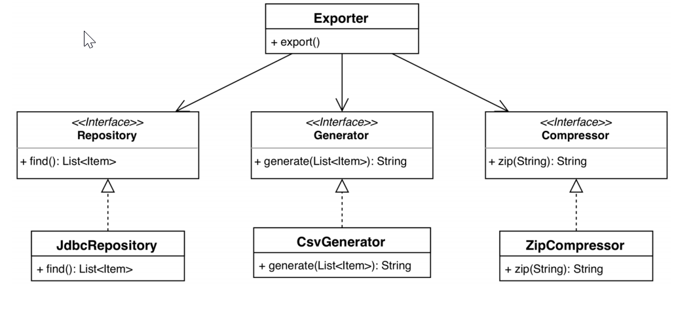

📌 코드 설계 (안정성과 확장성을 고려해 설계하기)
-
* 설계 관련 문서는 UML 다이어그램이 있다.
* 요구 사항은 항상 변하기 때문에 설계 문서를 최신 상태로 유지하려면 상당히 많은 노력이 필요
* 따라서 최소한의 설계문서만 남기는 것이 맞다.


<br/>

📌 애자일의 코드 설계 방식
-
* 애자일 코드 설계
* 디자인 원칙과 디자인 패턴
* TaskAgile 코드 설계


<br/>

📌 애자일 코드 설계
-

1 아키텍쳐 단계
    * 다음과 같은 질문을 통해서 답을 얻는다.
        * 시스템이 멀티 레이어 설계를 사용하는가?
        * 모놀리식 (하나) 서비스인가 마이크로(기능별) 서비스인가?
        * 서브 시스템은 무엇이며 SOAP이나 REST, AMQP 중 어떤 것을 사용해 통신하는가
            1. SOAP : xml 기반, http라서 웹통신 용의
            2. REST : json 기반, http method, url을 통해 자원의 CRUD
            3. AMQP : 메시지를 받기위한 프로토콜, 생산자가 메시지를 쌓아두고 사용자가 가져가는 방식
        * 서드파티 시스템과의 상호작용이 있는가? 서드파티 시스템과 어떻게 통신하는가?

2 추상화 단계
    * 서브 시스템의 패키지와 주요 컴포넌트에 중점을 두고 있음
        * 어떤 메소드를 사용자에게 보여 줄지, 어떤 기능을 그릴지 어떠한 것을 처리할지 설계

3 구현 단계
    * 필드와 메소드 구현에 중점을 둔다.
    * 세부사항이 많이 변하기 때문에 UML 다이아그램은 최소한으로만 유지해야한다.
    * UML 다이어그램을 최소한으로 유지한다는 말은 **키값와 핵심 필드를 표현하는 것 정도**에서 머물러야 한다는 의미이다.


<br/>   

📌 나쁜 설계의 증상
-
* 경직성 
    * 시스템을 변경하기 어렵다.
    * 확장성을 고려해야한다.
    
* 취약성 
    * 시스템 변경 시, 개념적으로 아무 관련 없는 부분이 망가진다.
    * 같은 기능을 하는 소스가 이곳 저곳에 절차지향 적으로 나열되어 있는 경우
    
* 부동성 
    * 재사용이 어렵다. 컴포넌트로 구분이 안되어 있다.
    * 잘못 설계를 한 경우, 어떤 부분을 컴포넌트화 할지 충분히 고려되지 않앟기 때문에 재사용이 어렵다.

* 침착성 
    * 옳은 방향으로 수정하는 것보다, 단기적인 수정이 더 쉬운 경우
    * 취약성과 비슷한 맥락이 있다. 또한, 정석적인 방법이 아닌, 방법으로 구현을 한 경우 옳은 방향으로 수정이 어렵기 때문에 옳지 않은(쉬운) 방향으로 소스를 수정하는 경우가 있다.
    
* 불필요한 복잡성 
    * 직접적인 효용이 전혀 없는 기반구조가 설계에 포함되어 있음 
    
* 불필요한 반복 
    * 하나로 묶을 수 있는 부분이 설계에 포함되어 있는 경우

* 불투명성 
    * 코드 의도를 파악하기 어려움


<br/>   


📌 애자일 코드 설계 실천의 방법
-
1. 아키텍쳐 단계에서
    * 최상위 단계에서 시스템이 어떻게 동작해야할지 아이디어를 이미 가지고 있어야 한다.
    * 때때로 새로운 기술을 도입하는 경우, 설계를 검증하기 위해 프로토타입을 만들 수 있어야 한다.
    
2. 추상화 단계
    * 세부 사항을 피하고 상위 수준의 정보만을 제공해야함 
        * 사용자에게 어떤 기능을 제공할 것인지 결정
    * 추상화의 결과물이 **내부적으로는** 모듈이 어떤게 동작하는 이해할 수 있도록 많은 지침을 제공한다.

3. 구현 단계
    1. 테스트 주도 개발 
        * 애자일에서 프로젝트의 구현은 단위 테스트에 의존하기 때문에 테스트가 중요하다. 
        * 코드를 검증할 테스트 케이스가 있을 때 자주 리펙터링을 수행함으로써, 이전에 언급한 나쁜 설계 증상을 겪지 않도록 한다.
    
    2. 인수 테스트
        * 고객이 지정한 사용자 스토리의 세부사항을 확인하기 위한 단계 (사용자 입장에서 기능 테스트)
        * 인수 테스트는 반복적으로 실행 될 수 있어야 한다.
        
    3. 리팩터링 
        * 테스트 케이스를 통과하는데 필요한 코드를 작성하는 과정

    4. 현재 스토리에 집중하기
        * 미래의 너무 많은 케이스를 고려해서 코드를 작성할 필요는 없다. 
        * 차피 많은 부분이 변경 될 것이다.


<br/>

📌 디자인 원칙과 디자인 패턴 [자세히 보기](https://github.com/donghyeon0725/SOLID_designPattern) 
-
SOLID 디자인 원칙.

    * SRP : The Single Responsibility Principle, 단일 책임 원칙
    * OCP : The Open-Closed Principle, 개방-폐쇄 원칙
    * LSP : The Liskov Substitution Principle, 리스코프 치환 원칙
    * ISP : The Interface Segregation Principle, 인터페이스 분리 원칙
    * DIP : The Dependency Inversion Principle, 의존 관계 역전 원칙

<br/>

단일 책임 원칙
-
* 단일 책임을 가져야 한다. 한 클래스는 변경에 대한 이유를 하나만 가진다. 예를 들어, QR코드를 스캔하는 기능과 스캔한 상품의 가격을 계산하는 기능을 수정하려고 할 때, 같은 클래스를 수정하게 된다면? 이미 그 클래스는 2개 이상의 책임을 가지고 있는 것이다. SRP 위반이다.
* 단일 책임 원칙은 변경의 관점에서 접근 해야한다. 즉, 변경을 쉽게 하기 위해서 책임을 하나만 가져야 한다고 말하는 것이다. 책임을 하나만 가진다는 말은 변경하기 쉬운 코드가 된다는 뜻이다.(해당 책임을 하는 클래스 하나만 변경하면 끝나기 때문에) 
* 단일 책임 원칙을 지키면 기능의 변경을 위해서 여러 클래스 또는 메소드를 변경할 필요가 없게 되는 이점을 얻게된다.
* 특정 부분만 자주 변경될 가능성이 있다면 그 부분만 분리 해냄으로써, SRP 를 지킬 수 있다. 
* 응집도는 높고 결합도는 낮다고 할 수 있다. 기능 변경을 위해 수정이 한곳으로 집중됨



* dial 이라는 메소드에서 Dial A와 B, C에 관련한 처리를 모두 해주고 있음. 
* 따라서 dial은 상황에 따라 dial을 구분하는 역할 뿐 아니라, 직접접인 dial 역할 또한 하고 있는 것
* SRP 위반임


* 인터페이스로 Dial 분리
* 필요한 경우 외부에서 주입 => 낮은 결합도
* Dial의 변경이 필요한 경우 해당 클래스만 변경하면 끝


<br/>


개방-폐쇄 원칙(OCP)
-
* 소프트웨어 아티팩트는 확장에 대해서는 열려 있어야 하고 수정에 대해서는 닫혀 있어야 한다는 말이다.
* 이를 잘 지킬 경우, 기존 소스를 수정하는 것이 아닌 추가를 함으로써 변경이 가능하다
```js
class Circle extends Shape {
    constructor(radius, point) {
        this.type = 'circle'
        // ...
    }
}
class Square extends Shape() {
    constructor(radius, point) {
        this.type = 'square'
        // ...
    }
}

function drawCircle(circle) {
    // 원 그리기 로직
}

function drawSquare(square) {
    // 정사각형 그리기 로직
}

function drawAllShapes(shapes) {
    shapes.forEach((shape) => {
        if (shape.type === 'circle') {
            drawCircle(shape)    
        } else if (shape.type === 'square') {
            drawSquare(shapes)
        }
    })
}
```
* 위 코드는 새로운 모양을 필요로 할 때, drawAllShapes를 수정해야만, 새로운 모양을 그릴 수 있기 때문에 OCP 원칙을 위반한다. 
* 그렇게 될 경우 변경 사항에 대해(수정 사항) 닫혀 있지는 않다.

```js
class Circle {
    // ...
    draw() {
        // 원 그리기 로직
    }   
}

class Square {
    // ...
    draw() {
        // 정사각형 그리기 로직
    }   
}

function drawAllShapes(shape) {
    shapes.forEach((shape) => {
        shape.draw()
    })
}
```
* 새로운 도형을 받아서 draw 를 호출함으로 써, 새로운 도형을 추가하기만 해도 된다.
* 이는 이제 "새로운 유형의 모양을 지원해야한다."에 대해서는 닫혀 있으나, "특정 순서대로 그려달라" 같은 요구사항에 대해 닫혀있지는 않다.
* 하지만, 이는 리펙터링하지 말고 두면 된다. 실제로 요구사항은 끊임 없이 변화하고 어떻게 요구 사항이 변할지 모르기 때문이다.


<br/>

리스코프 치환 원칙
-
* 서브 타입을 사용할 때는 프로그램의 정확성을 깨뜨리지 않고 바꿀 수 있어야 한다.
* 여기서 서브 타입이란 상위 타입을 상속 받은 클래스를 이야기 한다.
* 논리적으로 보았을 때 정사각형은 직사각형 종류중 하나이기 때문에, 일반적으로 상속의 관계로 표현하기 쉬우나, 정사각형의 경우, 높이를 2배 올리면 너비는 4배가 증가하나, 직사각형은 2배가 증가한다. 이 말은 즉, 직사각형을 상속 받은 정사각형의 동작이 달라짐을 의미한다.
* 따라서 리스코프 치환 원칙에 따르면 정사각형은 직사각형과 상속관계가 될 수 없다.
* 마찬가지로 "동물"의 속성을 상속 받은 "개"와 "고양이"의 "걷기", "뛰기" 메소드를 동물 클래스로 옮길 경우 리스코프 치환원칙을 위반하게 된다. 모든 동물이 걷거나 뛰진 않기 때문에 동물의 인스턴스를 "고래" 같은 것으로 바꾸면 해당 프로그램은 오류가 날 것이기 때문이다.
* 리스코프 치환 원칙을 지켜야만, 복잡한 상속 관계 속에서 자식 클래스를 일일이 찾아 보지 않고도 클래스를 교환할 수 있게 되는 것이다. 

위 말을 쉽게 정리하자면, 상속 받았을 경우 override가 가능한데, 이때 상위 클래스의 메소드가 return 하는 값이나, 필드값이 기존과 달라지면 안된다는 말이다. 

아래 링크에 좋은 예제가 있으니 참고하자 <https://pizzasheepsdev.tistory.com/9>


<br/>


인터페이스 분리 원칙(ISP)
-
* 클라이언트(인터페이스 사용자)가 사용하지 않을(작동을 하기 위해 전혀 사용할 필요가 없는 => 이는 단일 보통의 경우, 단일 책임 원칙도 위배 됨) 쓸모 없는 메소드가 있어서는 안된다는 말이다.
* 더 자세한 내용은 [자세히 보기](https://github.com/donghyeon0725/SOLID_designPattern) 를 참고한다.


<br/>

의존 관계 역전 원칙(DIP)
-
* 상위 수준의 모듈은 하위 수준의 모듈에 의존해서는 안되고 둘다, 추상화(여기서는 인터페이스)에 의존해야한다.
    * 상위 수준의 모듈이란, 비즈니스 규칙을 포함하는 클래스
    * 하위 수준의 모듈은 구현제의 세부사항을 포함함(인터페이스의 세부사항)
    * 하위 수준의 모듈은 수정이 빈번하게 일어나기 때문에, 절대 구현제에 의존(사용)해서는 안되고 추상화(인터페이스)에 의존해야한다. 
    
* 추상화는 구체적인 사항에 의존해서는 안 된다. 구체적인 사항이 추상화에 의존해야한다.



```java
public class Exporter {
    public Exporter(JdbcRepository repository, CsvGenerator generator, ZipCompressor compressor) {
        // ...
    }
    public void export() {
        List<Item> items = repository.find();
        if (items.isEmpty()) {
            // 빈 결과값을 처리하는 비즈니스 규칙
        return;
        }
        String csvFilePath = generator.generate(items);
        String compressed = compressor.zip(csvFilePath);
        // 압축된 파일을 처리하는 비즈니스 로직
    }
}
```
* Exporter 는 JdbcRepository, CsvGenerator, ZipCompressor를 주입 받고 있다. 
    * DB에서 레코드를 불러오는 방법, csv 파일을 생성하는 방법, 파일을 압축하는 방법에 대한 구현체의 세부 사항엔 관심이 없고 오직, 상위 수준의 (무엇을 할 것인가) 추상화에만 관심이 있다.

* 이 설계의 문제점은 Exporter 가 구체적인 클래스들에 직접 의존한다는 점이다.
    * 이는 DIP 원칙 위반이다. 이는, JdbcRepository 같이 구체적인 구현체를 변경함에 따라, Exporter 가 영향을 받을 뿐 아니라, Exporter를 확장할 수 없게 만든다.
    * MongoDB에서 데이터 추출하기 기능이나, XML 포맷으로 데이터를 추출하는 기능을 확장할 수 없다. 
* DIP 원칙에 따라 아래와 같이 하위수준의 추상화에 의존해야한다.




<br/>


📌 TaskAgile 코드 설계 (계층형 아키텍처 vs 헥사고날 아키텍쳐)
-
먼저 비즈니스와 도메인이 뭔지 알아야 할 것 같다.
* 도메인이란? 컴퓨터 프로그래밍으로 문제를 해결하기 위해 만들 소프트웨어 프로그램을 위한 요구사항, 용어, 기능을 정의한 것. 즉, 지협적으로는 UML 다이아그램등이 이 부분에 해당한다고 할 수 있다.
* 비즈니스 로직이란? 비즈니스 로직(Business logic)은 컴퓨터 프로그램에서 실세계의 **규칙**에 따라 데이터를 생성·표시·저장·변경하는 부분을 일컫는다.


<br/>


<br/>


계층형 아키텍쳐
-
* 계층형 아키텍처 패턴은 복잡한 시스템을 별도의 계층으로 나누는 데 활용하는 일반적인 기술
* 각 계층은 자체의 관심사에 중접을 둔다.
    * 프레젠테이션 계층
    * 비즈니스 계층
    * 데이터 접근 계층 등등
* 하위 계층은 자신을 의존하는 상위 계층에 영향을 전혀 받지 않아야 하고 상위 계층은 하위 계층에 직접적인 영향을 받는다.
* 엄격한 계층형 아키텍처는 바로 아래의 계층에만 의존할 수 있고 느슨한 계층형 아키텍처는 여러 하위 계층에 의존 가능
    * 엄격한 계층형 아키텍처
        * 프레젠테이션 계층->비즈니스 계층
        * 비즈니스 계층->데이터 접근 계층
        * 프레젠테이션 계층->데이터 접근 계층 (불가)
    * 느슨한 계층형 아키텍처
        * 프레젠테이션 계층->비즈니스 계층
        * 프레젠테이션 계층->데이터 접근 계층

* 허나 이는 도메인 모델의 관점(어떤 비즈니스 로직, 규칙이 있는지)이 아닌, 데이터 관점(데이터의 흐름, 변화 여부)에서 시스템을 바라보게 하는 경향이 있음


<br/>


헥사고날 아키텍처
-
* 알리스테어 콕번은 헥사고날 아키텍처, 즉 포트와 어댑터를 제안했다. 그는 이 아키텍처의 의도를 다음과 같이 말했다.
    * 헥사고날 아키텍처는 사용자, 프로그램, 자동화된 테스트 또는 배치 스크립트로 애플리케이션을 동일하게 구동할 수 있게 하며, 최종 런타임 장치 및 데이터베이스와 분리하여 애플리 케이션을 개발하고 테스트할 수 있도록 한다.


* 가운데 핵심인 애플리케이션이 있다. 모든 비즈니스 로직을 포함하는 계층이며, 경계를 만든다.
* 그리고 중심부에는 도메인 모델이 있다. 여기서 도메인 모델은 빈약하지 않은(비즈니스 로직과는 분리 된 별도의) 도메인 모델을 포함한다.
* 해당 애플리케이션 중심부 주위에는 다이어그램의 A,B,C 어댑터와 같이 다른 포트에 도착한 외부 이벤트를 애플리케이션 **핵심부**에 대한 API 호출로 변환하는 **어댑터**가 있다.
* 어댑터 E는 DB와 상호 작용하고, 어댑터 F는 엘라스틱서치와 상호작용한다. G는 메모리에 데이터를 저장한다.
* 여기서 화살표는 어떤 방향으로 트리거 되었는지를 나타냄. 상호작용이 단방향이라는 것을 의미하지는 않는다.
* 이 헥사고날 아키텍처는 도메인 주도 설계(DDD)에 적합하다. 데이터베이스, 검색 엔진, 메시지큐, 메인전송과 같은 인프라에서 도메인 로직을 분리.
    * 다양한 유형의 클라이언트를 쉽게 지원하도록 확장이 가능(새 어댑터의 추가)
    

<br/>
    
헥사고날 아키텍쳐와 SOLID 디자인 패턴에 대해 요약한 글을 읽어보길 바랍니다. <https://blog.imqa.io/hexagonal-architecture/>
    