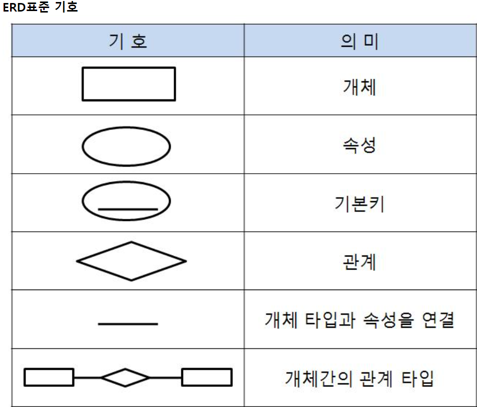
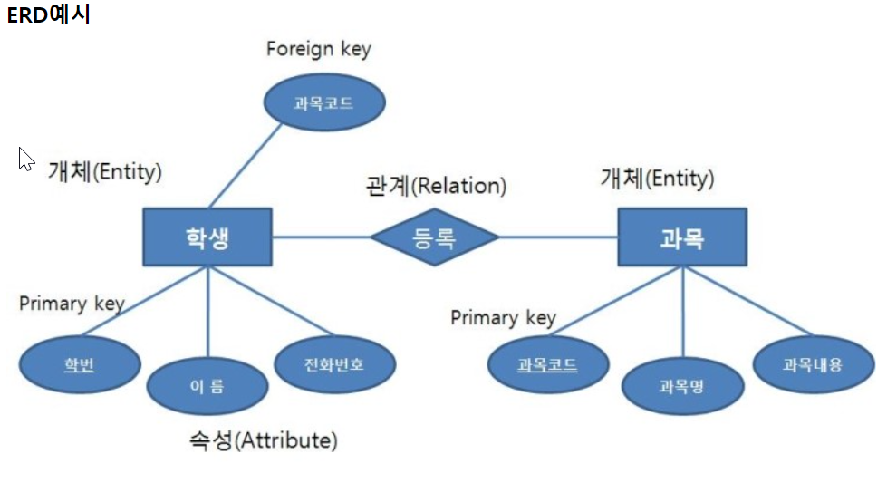
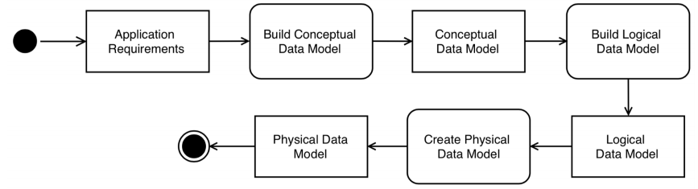

데이터 모델링이란?
-
* 시스템에 필요한 데이터를 효율적으로 DB에 넣고 뺄 수 있도록 설계하는 것 
* 좋은 데이터 모델링은 어플리케이션의 변경 사항은 유연하게 받아드릴 수 있도록 
* 애플리케이션을 만드는 과정에서 필수적인 단계. 애플리케이션의 요구사항을 기반으로 데이터 요구사항을 찾아내고 분석한 뒤, 저장, 조회, 업데이트 하는 방법을 정의하는 모델로 변환하는 것

학습 목표
-
* 데이터 모델링의 기초
* 데이터 모델링의 목적
* ER 다이어그램을 사용한 개념적 데이터 모델링
* 논리적 데이터 모델링
* RDBMS를 위한 물리적 데이터 모델링
* 몽고 DB를 위한 물리적 데이터 모델링

개념적 데이터 모델링
-
* 애플리케이션의 요구사항을 검토해 데이터 요구 사항을 반경하는 단계 [필요 사항 파악]
* ER(Entity-Relationship) 다이어그램으로 데이터 요구 사항을 개념적 데이터 모델로 문서화

ER 아이어그램 기호

ER 아이어그램 예시

* agile 에서는 사용자 스토리를 기반으로 개념적 데이터 모델링을 하고 있다.
    - 예를 들어 "나는 사용자로서 보드를 이용하기 위해 가입하기를 할 수 있다." 에서 사용자 데이터를 정의 해야하고 보드 정보를 저장하고 가져오는 기능을 제공해야 한다는 것을 파악할 수 있다
    - "등록된 사용자로서, 나는 다른 팀의 작업을 구성할 수 있도록 팀을 생성하기를 원한다."에서 팀을 저장하고 누가 어떤 팀을 생성했는지에 대항 사용자와 팀 간의 관계를 저장할 필요가 있음. 자세히 보면 작업과 팀 간의 관계도 저장할 필요가 있다.

논리적 데이터 모델링
-
* 개념적 데이터 모델링 다음 단계
* 요구 사항을 추가롭 분석하고 범위를 정함
* 예를 들어 사용자와 팀 간의 관계레 대해 다음과 같은 질문이 가능
    * 사용자가 몇 개의 팀까지 생성할 수 있습니까?
    * 사용자가 팀을 생성해야 합니까?
    * 팀을 생성하는 것 외에 다른 사용자가 생성한 팀에 참여할 수 있습니까?
    * 참여할 수 있다면 몇 개의 팀까지 사용자가 참여할 수 있습니까?
    * 사용자가 다른 팀에서 이미 사용 중인 이름의 팀을 생성할 수 있습니까?
    * 팀 이름을 어떻게 식별할 수 있습니까?
* 이 때 정규화(데이터 수정, 삽입, 삭제 동안 데이터 중복과 예외 제거, 데이터 의존성 확인하는 단계)와 비정규화(성능 개선을 위한 고려)를 수행해야함

물리적 데이터 모델링
-
* 논리적 데이터 모델이 있다면 물리적 데이터 모델을 생성할 수 있음
* DB에 테이블을 설계하는 과정
* DB는 성능 향상을 위해 클러스터링(여러 pc 병렬 연결), 파티셔닝(데이터를 컬럼 기준 또는 개수 기준으로 나누어서 여러 곳에서 가져오게 함으로 풀스캔의 범위를 줄여 속도를 향상시킴), 데이터압축, 인덱싱 같은 기능을 지원

데이터 모델링의 단계
-

* 요구 사항을 기반으로 대념적 데이터 모델 구축
* 개념적 데이터 모델로 논리적 데이터 모델 구축
* 논리적 데이터 모델 기반으로 물리적 데이터 모델 구축

---

데이터 모델링에서 자주 사용하는 전문 용어
-

엔티티
-
* DB에 저장하려는 것을 나타내기 위해 엔티티(Entities)라는 용어 사용
* 도메인의 복작성을 추상화 하기 위해 DB에 저장될 데이터를 일정 단위별로 나눈 객체
* 자바로 치면 엔티티클래스(똑같은 의미는 아니나, vo로 어느정도 해당), DB로 치면 테이블 정도의 느낌이다. 
* 고유식별자를 가져야한다.

속성
-
* 엔티티가 가진 필드를 속성이라고 한다.
* DB로 치면 컬럼, 자바의 vo로 치면 필드이다.

관계
-
* 먼저, 테이블 간의 관계를 생성, 등록, 삭제, 포함 등등의 키워드로 나타낼 수 있음
* 엔티티와 엔티티간에 숫자관계를 나타낼 때, 1:1 관계, 1:n관계, n:m 관계로 표현할 수 있는데 이를 카디널리티라고 한다. 

기본키
-
* 엔티티를 고유하게 식별하는데 활용할 수 있는 속성
* 기본적으로 식별자는 변경할 수 없어야 한다. 
* 고유식별자는 아니지만, 아이디, 이메일 주소와 같이 고유식별 객체를 찾는데 도움을 주는 키는 후보키(candidate keys)라고 부른다. 
* 기본키로 시스템에서 생성해주는(예를 들면 MYSQL의 AUTO INCREMENT) UUID(Universally Unique Identifier) 기본키로 사용 가능하고 이런키를 모두 대체키(Surrogate keys) 라고 한다. 

외래키
-
* 다른 엔티티와 관계를 형성하는 방법이다.
* 다른 엔티티의 기본키를 저장할 공간(필드, 컬럼)을 의미

---

데이터 모델링의 목적
-
* 완전성 : 사용자 스토리에 명시된 기능 정도는 모두 구현할 수 있어야 한다. 
* 중복 최소화 : 같은 데이터를 여러번 저장하는 것에서 발생하는 값불일치, 성능 저하 문제를 막아야함. 다만 중복저장이 성능 향상을 이룰 수 있는 경우 중복저장함
    - 예를 들면 사용자 정보 테이블에 사용자의 성과, 이름을 모두 저장한다고 하면 이니셜을 가져오는 기능을 위해 결로 컬럼을 만드는 것은 중복이며, 이름이 바뀌었을 때 이니셜을 변경하는 것을 깜박하면 데이터 불일치 문제가 발생함
    - 데이터를 저장할 때는 되도록 날 것 그대로 저장하고 select 할 때 필요에 따라 계산을 하는 것이 보통 좋음
* 확장성 : 요구 사항을 충분히 예측해서 확장 가능성이 있는 부분으로 판단하고 확장 되었을 때 기준으로 모델링을 하는 것. 과도하면 안됨.
